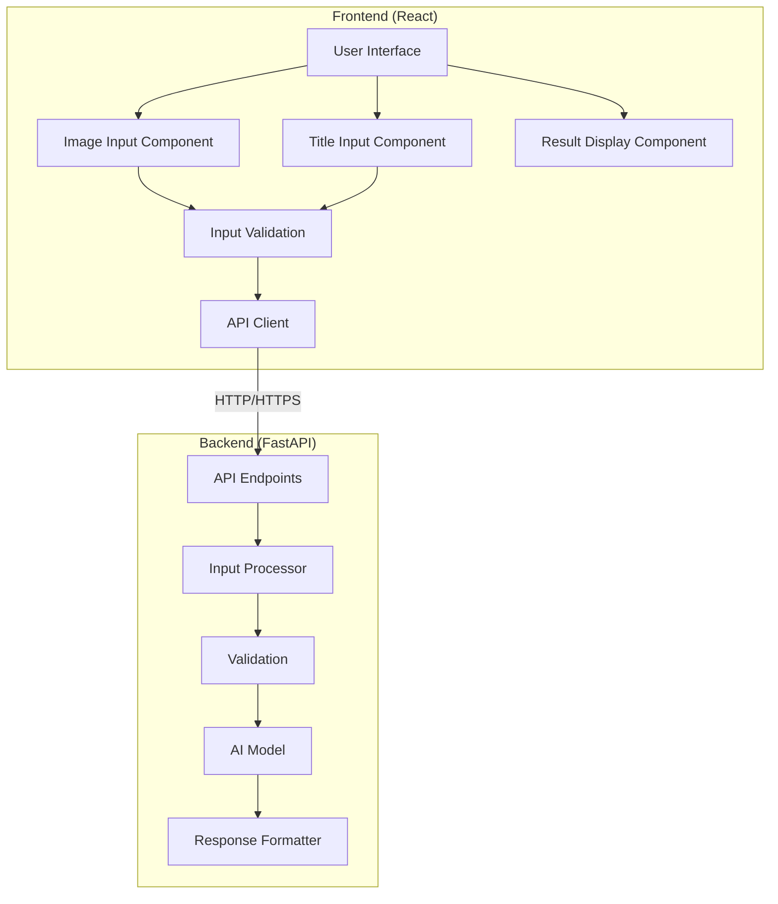

# Design Document

## Overview

SnapRate is an AI-powered product rating estimator that predicts customer ratings based on product images and titles. The application is designed to be lightweight, modular, and mobile-first, providing e-commerce sellers, designers, and developers with insights into how their products might be perceived by potential customers.

The system consists of two main components:
1. A React-based frontend that provides an intuitive user interface for image and title input
2. A FastAPI backend that processes the inputs and returns rating predictions

This design document outlines the architecture, components, interfaces, data models, error handling, and testing strategy for the SnapRate application.

## Architecture

SnapRate follows a client-server architecture with decoupled frontend and backend components. This separation allows for independent development, testing, and deployment of each component.

### High-Level Architecture Diagram



### Technology Stack

#### Frontend
- React (with Vite for build tooling)
- Tailwind CSS for styling
- Framer Motion for animations
- Axios for API communication

#### Backend
- FastAPI for API framework
- Python for server-side logic
- Pillow for image processing
- Pre-trained models from HuggingFace (for AI mode)
- Docker for containerization

## Components and Interfaces

### Frontend Components

#### 1. App Container
- Manages application state
- Handles routing (if needed)
- Provides context for theme and global state

#### 2. Image Input Component
- Provides three input methods:
  - Camera capture (using HTML5 `<input type="file" capture="environment">`)
  - File upload (using standard file input)
  - URL input (using text input)
- Validates image format and size
- Displays image preview
- Handles error states

#### 3. Title Input Component
- Provides text input for product title
- Validates title length and content
- Handles error states

#### 4. Prediction Button Component
- Triggers the prediction process
- Displays loading state during API call
- Handles disabled state when inputs are invalid

#### 5. Result Display Component
- Shows star rating (1-5 with decimal precision)
- Displays confidence percentage
- Presents textual explanation
- Provides visual feedback using animations

### Backend Components

#### 1. API Endpoints
- `/predict` (POST): Accepts multipart/form-data with image and title
- `/healthcheck` (GET): Returns system status

#### 2. Input Processor
- Parses multipart/form-data
- Extracts image from file upload or URL
- Validates input data

#### 3. AI Model
- Processes image using computer vision techniques
- Analyzes title using NLP techniques
- Combines analyses to generate rating prediction
- Supports two modes:
  - Rule-based heuristics (MVP/demo mode)
  - Pre-trained models (AI mode)

#### 4. Response Formatter
- Structures prediction results into JSON format
- Generates human-readable explanations
- Handles error responses

## Data Models

### Request Data Model

```python
class PredictionRequest:
    # File upload
    image_file: Optional[UploadFile] = None
    # URL input
    image_url: Optional[str] = None
    # Product title
    title: str
```

### Response Data Model

```python
class PredictionResponse:
    # Rating on a scale of 1-5 (with decimal precision)
    rating: float
    # Confidence score as a percentage
    confidence: float
    # Human-readable explanation
    explanation: str
```

### Error Response Model

```python
class ErrorResponse:
    # HTTP status code
    status_code: int
    # Error message
    message: str
    # Additional details (optional)
    details: Optional[Dict] = None
```

## Error Handling

### Frontend Error Handling

1. **Input Validation Errors**
   - Display inline error messages for invalid inputs
   - Disable submission button until errors are resolved

2. **Network Errors**
   - Display user-friendly error messages for connection issues
   - Implement retry mechanism for transient failures

3. **API Errors**
   - Parse error responses from the API
   - Display appropriate error messages based on error type

### Backend Error Handling

1. **Input Validation Errors**
   - Validate request data before processing
   - Return 400 Bad Request with specific error details

2. **Processing Errors**
   - Handle exceptions during image and text processing
   - Return 500 Internal Server Error with appropriate message

3. **Model Errors**
   - Handle exceptions during model inference
   - Implement fallback to rule-based prediction if model fails

## Testing Strategy

### Frontend Testing

1. **Unit Tests**
   - Test individual components in isolation
   - Mock API responses for predictable behavior
   - Test input validation logic

2. **Integration Tests**
   - Test component interactions
   - Test form submission and response handling

3. **Responsive Design Tests**
   - Test UI across different screen sizes
   - Verify mobile-specific features (camera access)

### Backend Testing

1. **Unit Tests**
   - Test individual functions and classes
   - Mock external dependencies

2. **API Tests**
   - Test endpoints with various input combinations
   - Verify response formats and status codes

3. **Model Tests**
   - Test prediction accuracy with sample inputs
   - Verify explanation generation

### End-to-End Tests

1. **Happy Path Tests**
   - Test complete user flow from input to result display
   - Verify correct rendering of prediction results

2. **Error Path Tests**
   - Test system behavior with invalid inputs
   - Verify error handling and recovery

## Security Considerations

1. **Input Validation**
   - Validate all user inputs to prevent injection attacks
   - Implement file type and size restrictions for uploads

2. **CORS Configuration**
   - Configure proper CORS headers to secure API access
   - Restrict origins to trusted domains

3. **Rate Limiting**
   - Implement rate limiting to prevent abuse
   - Use IP-based or token-based rate limiting

4. **Deployment Security**
   - Use HTTPS for all communications
   - Follow platform-specific security best practices

## Performance Considerations

1. **Image Processing**
   - Resize images before processing to reduce computation
   - Implement caching for repeated predictions

2. **API Optimization**
   - Optimize API responses for minimal payload size
   - Implement request queuing for high traffic scenarios

3. **Frontend Optimization**
   - Implement lazy loading for components
   - Optimize bundle size for faster loading

## Deployment Strategy

### Frontend Deployment

- Build optimized production bundle
- Deploy to static hosting service (Vercel, Netlify)
- Configure CDN for global distribution

### Backend Deployment

- Containerize using Docker
- Deploy to cloud platform (Render, Fly.io)
- Implement health checks and monitoring

## Future Extensibility

The design accommodates future enhancements through:

1. **Modular AI Model**
   - Easily swap rule-based logic with more sophisticated models
   - Support for model versioning and A/B testing

2. **API Versioning**
   - Support for multiple API versions to ensure backward compatibility

3. **Component-Based Frontend**
   - Easily add new features through additional components
   - Support for theming and customization

4. **Planned Extensions**
   - A/B testing mode for comparing products
   - History tracking for previous predictions
   - Export functionality for rating cards
   - Admin dashboard for monitoring